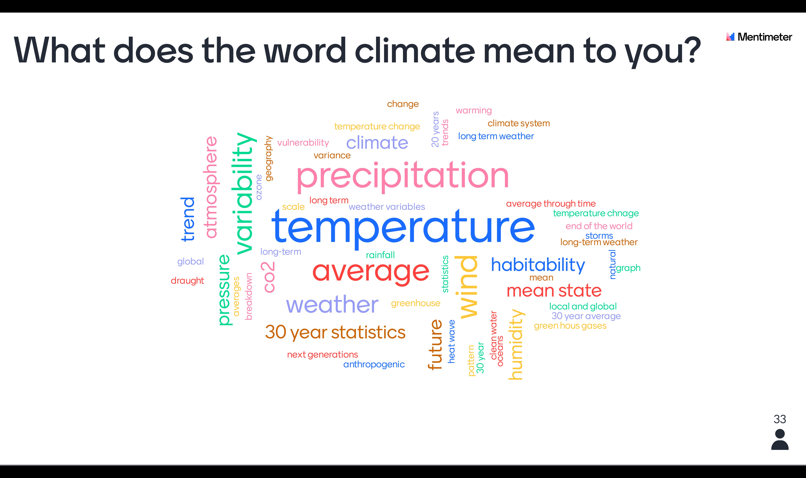
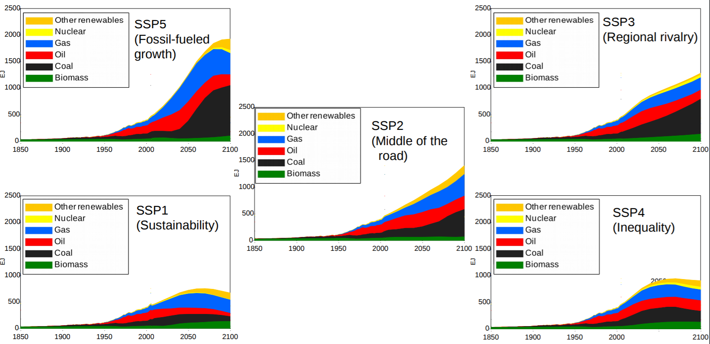

class: center, middle

# Getting your hands-on Climate data

## Anne Fouilloux
## University of Oslo, Norway

---

##  How we will operate?

### Registration/Login to Galaxy Climate

- We will be using Galaxy Climate https://usegalaxy.eu/ for this tutorial
- If you have already registered to Galaxy Europe ([https://usegalaxy.eu/](https://usegalaxy.eu/) then you are ready to go
- Otherwise, please register before we start at [https://usegalaxy.eu/login](https://usegalaxy.eu/login).

### Join Climate training group

- Please go to the following URL:

[https://usegalaxy.eu/join-training/gcc-climate](https://usegalaxy.eu/join-training/gcc-climate)

You will be added to the training group and put into a private queue which should be a bit faster than our regular queue. Our training queue will be available from 2020-07-17 to 2020-07-19. 

---

## Collaborative document

We will be using a collaborative document:
- where participants can introduce themselves
- so that I can follow your progress
- where you can ask questions (always at the bottom of the document) that I or any of you can answer.

---

## Agenda

- Short presentation on the topic
- Presentation of the training material [Getting your hands-on climate data](https://training.galaxyproject.org/training-material/topics/climate/tutorials/climate-101/tutorial.html)
- Introduction of the datasets
- Galaxy tools you can use for the hands-on
- Hands-on exercises: 
    - You work on the provided material, feel free to dicuss within others,
    - Use the collaborative document to indicate when you are done with an exercise,
    - Should you have any problem, please use the *chat*,
    - I have set-up a **get help table** that you can visit whenever you need individual support.
- Discussion and feedback.

---

## What we mean by "Climate"?

To make sure we all have the same understanding:

*According to [wikipedia](https://en.wikipedia.org/wiki/Climate), Climate is defined as the **average state** of everyday’s weather condition **over a period of 30 years**. It is measured by assessing the patterns of variation in temperature, humidity, atmospheric pressure, wind, precipitation, atmospheric particle count and other meteorological variables in a given region over long periods of time. Climate differs from weather, in that weather only describes the short-term conditions of these variables in a given region.*

---

## Weather versus climate

Watch [this Video](https://youtu.be/e0vj-0imOLw) to get an illustration of the difference between climate and weather.

---

## Types of climate data resources

When we talk about climate data, the type of data can vary significantly. We have very little actual observations at the scale of climate and usually not covering a large area.

The type of climate data you will be using greatly depends on the period of time you are interested in:

- Observations
- Re-analyses
- Climate models

---

## Observations

## Direct observations

These are measurements (from ground stations, buoys, satellites, etc.) of the occurrence of one or more physical variables (temperature, humidity, wind, etc.) at one or more particular times and places in and on the atmosphere, ocean, etc. 

Source: https://uls.climate.copernicus.eu

---

## Indirect observations

Observations are described as **indirect** when they are derived from other observations, for example information related to past climate (these are sometimes referred to as "climate proxies") can be inferred from tree rings (dendrochronology), lake sediments (varves) or ice cores.

Source: https://www.earth.columbia.edu

---

## Models

Numerical models are a mathematical representation of the climate developed by scientists to understand and predict the climate system. 
In order to be able to do this, the models divide the earth, ocean and atmosphere into one (or more) grid(s). The values of the predicted variables, such as surface pressure, wind, temperature, humidity and rainfall are calculated at each grid point over time, to predict their future values.

*Source: [https://www.climate.gov/maps-data/primer/climate-models](https://www.climate.gov/maps-data/primer/climate-models)*

## Re-analyses

A climate re-analysis gives a numerical description of the recent climate, produced by combining models with observations. It contains estimates of atmospheric parameters such as air temperature, pressure and wind at different altitudes, and surface parameters such as rainfall, soil moisture content, and sea-surface temperature. The estimates are produced for all locations on earth, and they span a long time period that can extend back decades or more.

---

## Climate models

Various types of models are used to analyse different aspects of the climate. 
All have different ways to represent the real world, depending on how researchers prioritize and perform these simplifications (in terms of parameterizations, etc.) in the numerical climate model.
They will all provide different outputs but the collective results give a better overview of the real world than any single model.

---

## Climate prediction *vs.* projection

### Climate prediction

A **climate prediction** (or climate forecast) is an attempt to produce an estimate of the actual evolution of the natural climate in the future, for example, at seasonal, inter-annual or long-term time scales. Since the future evolution of the climate system may be highly sensitive to initial conditions, such predictions are usually probabilistic in nature.

### Climate projections

**Climate projections** are distinct from climate predictions in that projections depend upon emission/concentration/radiative forcing **scenarios**, which are based on assumptions concerning, for example, future socio-economic and technological developments that may or may not be realized and are therefore subject to substantial uncertainty.

Within the Coupled Model Intercomparison Project (CMIP), now in its 6th phase, project simulations of the research community provide model output that will fuel climate research and climate impact studies for the next 5 to 10 years, while its careful analysis will form the basis for future climate assessments

---

## Shared Socio-economic Pathway (SSP)

= societal development pathway

The SSPs were developed as a joint community effort and describe global developments that
together would lead to different challenges for mitigation and adaptation to climate change.
SSPs comprise five alternative narratives that describe the main characteristics of the
pathways in qualitative terms as well as quantitative descriptions for key elements including
population, economic growth and urbanization

---

## SSP narratives

- SSP1 Sustainability: Taking the Green Road (Low challenges to mitigation and adaptation)

- SSP2: Middle of the Road (Medium challenges to mitigation and adaptation)

- SSP3	Regional Rivalry: A Rocky Road (High challenges to mitigation and adaptation)

- SSP4	Inequality: A Road Divided (Low challenges to mitigation, high challenges to adaptation)

- SSP5	Fossil-fueled Development: Taking the Highway (High challenges to mitigation, low challenges to adaptation)

---

### SSP1	Sustainability

- Taking the Green Road (Low challenges to mitigation and adaptation)

The world shifts gradually, but pervasively, toward a more sustainable path, emphasizing more inclusive development that respects perceived environmental boundaries. Management of the global commons slowly improves, educational and health investments accelerate the demographic transition, and the emphasis on economic growth shifts toward a broader emphasis on human well-being. Driven by an increasing commitment to achieving development goals, inequality is reduced both across and within countries. Consumption is oriented toward low material growth and lower resource and energy intensity.

---

### SSP2	Middle of the Road (Medium challenges to mitigation and adaptation)

The world follows a path in which social, economic, and technological trends do not shift markedly from historical patterns. Development and income growth proceeds unevenly, with some countries making relatively good progress while others fall short of expectations. Global and national institutions work toward but make slow progress in achieving sustainable development goals. Environmental systems experience degradation, although there are some improvements and overall the intensity of resource and energy use declines. Global population growth is moderate and levels off in the second half of the century. Income inequality persists or improves only slowly and challenges to reducing vulnerability to societal and environmental changes remain.

---

### SSP3	Regional Rivalry

A Rocky Road (High challenges to mitigation and adaptation)

A resurgent nationalism, concerns about competitiveness and security, and regional conflicts push countries to increasingly focus on domestic or, at most, regional issues. Policies shift over time to become increasingly oriented toward national and regional security issues. Countries focus on achieving energy and food security goals within their own regions at the expense of broader-based development. Investments in education and technological development decline. Economic development is slow, consumption is material-intensive, and inequalities persist or worsen over time. Population growth is low in industrialized and high in developing countries. A low international priority for addressing environmental concerns leads to strong environmental degradation in some regions.

---

### SSP4	Inequality 

A Road Divided (Low challenges to mitigation, high challenges to adaptation)
Highly unequal investments in human capital, combined with increasing disparities in economic opportunity and political power, lead to increasing inequalities and stratification both across and within countries. Over time, a gap widens between an internationally-connected society that contributes to knowledge- and capital-intensive sectors of the global economy, and a fragmented collection of lower-income, poorly educated societies that work in a labor intensive, low-tech economy. Social cohesion degrades and conflict and unrest become increasingly common. Technology development is high in the high-tech economy and sectors. The globally connected energy sector diversifies, with investments in both carbon-intensive fuels like coal and unconventional oil, but also low-carbon energy sources. Environmental policies focus on local issues around middle and high income areas.

---

### SSP5	Fossil-fueled Development 

Taking the Highway (High challenges to mitigation, low challenges to adaptation)

This world places increasing faith in competitive markets, innovation and participatory societies to produce rapid technological progress and development of human capital as the path to sustainable development. Global markets are increasingly integrated. There are also strong investments in health, education, and institutions to enhance human and social capital. At the same time, the push for economic and social development is coupled with the exploitation of abundant fossil fuel resources and the adoption of resource and energy intensive lifestyles around the world. All these factors lead to rapid growth of the global economy, while global population peaks and declines in the 21st century. Local environmental problems like air pollution are successfully managed. There is faith in the ability to effectively manage social and ecological systems, including by geo-engineering if necessary.

---

---

## How good are climate models?

- Climate models are improving
- Climate models have "biases"

--> We usually use several models together (multi-models)

---

## Where to start

*There is a wealth of data and information available about the past, current and future climate.*

**Not all of it is up-to-date and trustworthy**

- Check the provenance and data provider credentials

**Not all the variables/parameters are necessarily relevant for your study**

- Prioritize the use of Essential Climate Variables

**Not all the variables are reliable**

- Prioritize observations and re-analyses for past climate

---

## Training material

---

## Datasets

---

## Galaxy tools

- **Select lines that match an expression**
- **Datamash**
- **Text reformatting with awk**
- **Scatterplot w ggplot2**
- **climate stripes from timeseries**
- **Copernicus Essential Climate Variables**
- **map plot gridded (lat/lon) netCDF data**
- **NetCDF xarray Metadata Info**

