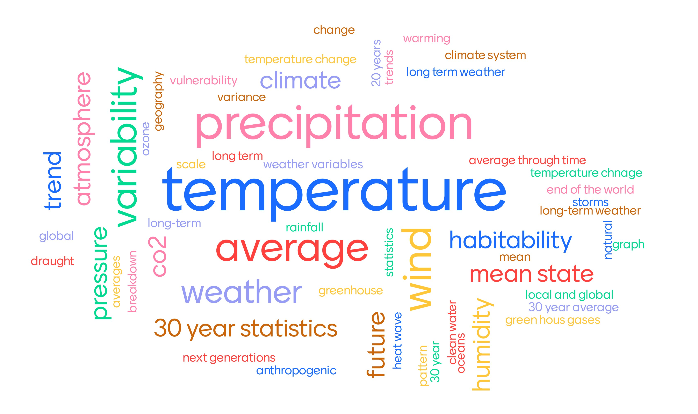

class: center, middle

# Getting your hands-on Climate data

## Anne Fouilloux
## University of Oslo, Norway

---

#  How we will operate?

## Registration/Login to Galaxy Climate

- We will be using Galaxy Climate https://usegalaxy.eu/ for this tutorial
- If you have already registered to Galaxy Europe ([https://usegalaxy.eu/](https://usegalaxy.eu/) then you are ready to go
- Otherwise, please register before we start at [https://usegalaxy.eu/login](https://usegalaxy.eu/login).

## Join Climate training group

- Please go to the following URL:

[https://usegalaxy.eu/join-training/gcc-climate](https://usegalaxy.eu/join-training/gcc-climate)

You will be added to the training group and put into a private queue which should be a bit faster than our regular queue. Our training queue will be available from 2020-07-17 to 2020-07-19. 

---

# Agenda

- Practical organization
- Short presentation on the topic
- Presentation of the training material [Getting your hands-on climate data](https://training.galaxyproject.org/training-material/topics/climate/tutorials/climate-101/tutorial.html)
- Introduction of the datasets
- Galaxy tools you can use for the hands-on
- Hands-on exercises: 
    - You work on the provided material, feel free to discuss with others,
    - Use the collaborative document to indicate when you are done with an exercise,
    - Should you have any problem during exercises, use the chat in remo.

---

# Practical organization

- We will only use a web browser (Chrome is recommended)
- and have 4 tabs:
	- one for remo
	- one for the [training material](https://training.galaxyproject.org/training-material/topics/climate/tutorials/climate-101/tutorial.html) (hands-on)
	- one for [galaxy Europe](https://usegalaxy.eu/)
	- one for the shared document

That's already a lot to manage on a single screen therefore I recommend to close all the windows except your browser.

---

# What we mean by "Climate"?

To make sure we all have the same understanding:

*According to [wikipedia](https://en.wikipedia.org/wiki/Climate), Climate is defined as the **average state** of everyday’s weather condition **over a period of 30 years**. It is measured by assessing the patterns of variation in temperature, humidity, atmospheric pressure, wind, precipitation, atmospheric particle count and other meteorological variables in a given region over long periods of time. Climate differs from weather, in that weather only describes the short-term conditions of these variables in a given region.*

---

# Weather versus climate

Watch [this Video](https://youtu.be/e0vj-0imOLw) to get an illustration of the difference between climate and weather.

Source: [Animated short on statistics](https://youtu.be/e0vj-0imOLw) from Norwegian infotainment program Siffer. Produced by TeddyTV for NRK. Animation by Ole Christoffer Haga

---

# Types of climate data resources

- Observations
- Re-analyses
- Climate models

We have very little actual observations at the scale of climate and usually not covering a large area. 

The type of climate data you will be using greatly depends on the period of time you are interested in.

---

# Observations

## Direct observations

These are measurements (from ground stations, buoys, satellites, etc.) of one or more physical variables (temperature, humidity, wind, etc.) at one or more particular times and places. 

Source: https://uls.climate.copernicus.eu

---

## Indirect observations

They are derived from other observations:
- ice cores
- lake sediments
- tree rings

These are sometimes referred to as "climate proxies"

Source: https://www.earth.columbia.edu

---

# Models

Numerical models are a mathematical representation of the climate developed by scientists to understand and predict the climate system. 

Source: [https://www.climate.gov/maps-data/primer/climate-models](https://www.climate.gov/maps-data/primer/climate-models)

---

## Re-analyses

A climate re-analysis is produced by combining numerical models with observations so it can only provide information about the past climate. It contains estimates of the air temperature, wind at different altitudes, rainfall, soil moisture content, etc.
The estimates are produced for all locations on earth, and they span a long time period that can extend back decades or more.

## Climate models

Various types of models are used for different aspects of the climate. 
All have different ways to represent the real world, depending on how researchers prioritize and perform these simplifications (in terms of parameterizations, etc.) in the numerical climate model.

## How good are climate models?

Climate models are improving but have "biases" so we usually do not use one model only but severals that we combine together: the collective results give a better overview of the real world than any single model.

---

## Climate prediction *vs.* projection

### Climate prediction

A **climate prediction** (or climate forecast) is an attempt to produce an estimate of the actual evolution of the natural climate in the future, for example, at seasonal, inter-annual or long-term time scales. 

### Climate projections

**Climate projections** are distinct from climate predictions in that projections depend upon emission/concentration/radiative forcing **scenarios**, which are based on assumptions concerning, for example, future socio-economic and technological developments that may or may not be realized and are therefore subject to substantial uncertainty.

Within the Coupled Model Intercomparison Project (CMIP), now in its 6th phase, project simulations of the research community provide model output that will fuel climate research and climate impact studies for the next 5 to 10 years, while its careful analysis will form the basis for future climate assessments

---

# Shared Socio-economic Pathway (SSP)

**= societal development pathway**

The SSPs were developed as a joint community effort and describe global developments that
together would lead to different challenges for mitigation and adaptation to climate change.
SSPs comprise **five alternative** narratives that describe the main characteristics of the
pathways in qualitative terms as well as quantitative descriptions for key elements including
population, economic growth and urbanization.

Different pathways are defined by the magnitude of the challenges a future society
would face in adapting to or mitigating climate change if that socioeconomic pathway was pursued.

---

## SSPs and Shared Policy Assumptions (SPAs)

- <a href="https://en.wikipedia.org/wiki/Shared_Socioeconomic_Pathways#SSP1:_Sustainability_(Taking_the_Green_Road)">SSP1 Sustainability</a>: Taking the Green Road e.g. low challenges to mitigation and adaptation

- <a href="https://en.wikipedia.org/wiki/Shared_Socioeconomic_Pathways#SSP2:_Middle_of_the_road)">SSP2 Middle of the Road</a>:  Medium challenges to mitigation and adaptation

- <a href="https://en.wikipedia.org/wiki/Shared_Socioeconomic_Pathways#SSP3:_Regional_rivalry_(A_Rocky_Road)">SSP3 Regional Rivalry</a>: A Rocky Road e.g high challenges to mitigation and adaptation

- <a href="https://en.wikipedia.org/wiki/Shared_Socioeconomic_Pathways#SSP4:_Inequality_(A_Road_Divided)">SSP4 Inequality</a>: A Road Divided e.g. low challenges to mitigation, high challenges to adaptation

- <a href="https://en.wikipedia.org/wiki/Shared_Socioeconomic_Pathways#SSP5:_Fossil-Fueled_Development_(Taking_the_Highway)">SSP5 Fossil-fueled Development</a>: Taking the Highway e.g. high challenges to mitigation, low challenges to adaptation

---

## SSPs and Shared Policy Assumptions (SPAs)

Source: https://www.becc.lu.se/sites/becc.lu.se/files/climate_modelling_ralf_doscher.pdf

---

# Where to start to get climate data?

*There is a wealth of data and information available on the **web** about the past, current and future climate.*

**Not all of it is up-to-date and trustworthy**

- Check the provenance and data provider credentials

**Not all the variables/parameters are necessarily relevant for your study**

- Prioritize the use of [Essential Climate Variables](https://gcos.wmo.int/en/essential-climate-variables/about) (as we know they critically contribute to the characterization of Earth’ s climate).

**Not all the variables are reliable**

- For instance, temperature is usually reliable but precipitation is more difficult to estimate
- Prioritize observations and re-analyses for past climate

**Prefer authoritative data providers**

---

# Datasets

- Downloaded from [European Copernicus Climate Change Service (C3S)](https://climate.copernicus.eu/): free of use. To download new datasets, you need to [register](https://cds.climate.copernicus.eu/user/login?destination=%2F%23!%2Fhome) (free).
	- gridded observations e.g. combine different observations and interpolate on a grid 
	- resolution: 0.1 x 0.1 degrees 
- Data format:
	- The most common data format for Climate data is called [netCDF](https://www.unidata.ucar.edu/software/netcdf/) e.g. Network Common Data Form
	- But for the sake of convenience, we already downloaded the datasets from Copernicus Climate Data Store, pre-processed and converted them to *csv*/*tabular* format

- Available on [zenodo](https://zenodo.org/record/3776500#.XxHg-p4zY2w) for this tutorial:
	- [tg_ens_mean_0.1deg_reg_v20.0e_Paris_daily.csv](https://zenodo.org/record/3776500/files/tg_ens_mean_0.1deg_reg_v20.0e_Paris_daily.csv)
	- [ts_cities.csv](https://zenodo.org/record/3776500/files/ts_cities.csv)

---

# Galaxy tools

- **Select lines that match an expression** (select): *it can be used to search for a date*
- **Datamash**(datamash): *it can be used to make simple statistics (mean, minimum, maximum)*
- **Text reformatting with awk**(awk): *to split a column for instance a date so we can group per month or per year.*
- **Scatterplot w ggplot2**(ggplot2): *to make a plot*
- **climate stripes from timeseries**(stripes): *to visualize climate trend (on a timeserie)*
- **Copernicus Essential Climate Variables**(copernicus): *to download dataset (netCDF format) from Copernicus Climate*
- **map plot gridded (lat/lon) netCDF data**(netcdf): *to visualize netCDF data on a geographical map*
- **NetCDF xarray Metadata Info**(xarray): *to get the list of variables from a netCDF data file.*

To find one of these tool, search with the word in bracket.

---

# Where can you find the training material in Remo

- [Tutorial](https://training.galaxyproject.org/training-material/topics/climate/tutorials/climate-101/tutorial.html) is available in Remo through 
- [Slides](https://cicero.xyz/v3/remark/0.14.0/github.com/NordicESMHub/BCC2020-Climate/master/training.md/) are available in Remo through 

- Video with [step by step tutorial](https://vimeo.com/439167967) on the left panel. It can be used for the hands-on.

---

---

# Hands-on

## Collaborative document

We will be using a collaborative document:
- so that I can follow your progress
- where you can ask questions (always at the bottom of the document) that I or any of you can answer.

## Getting help
- Use the chat in remo, ask others at your table

## Break

- We will make one break in about 1 hour

